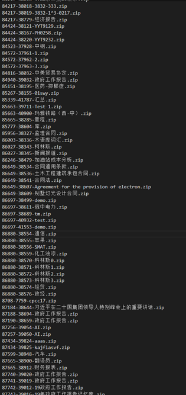
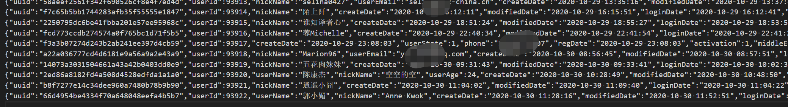
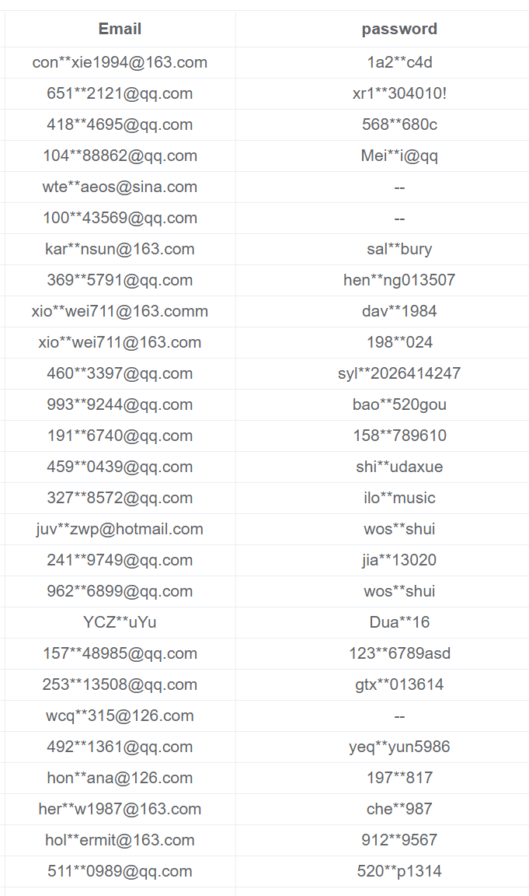
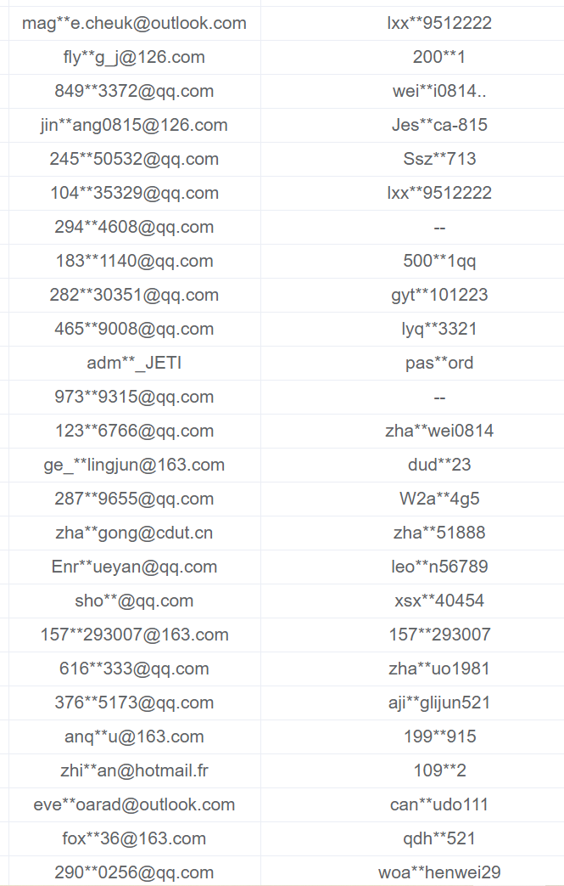
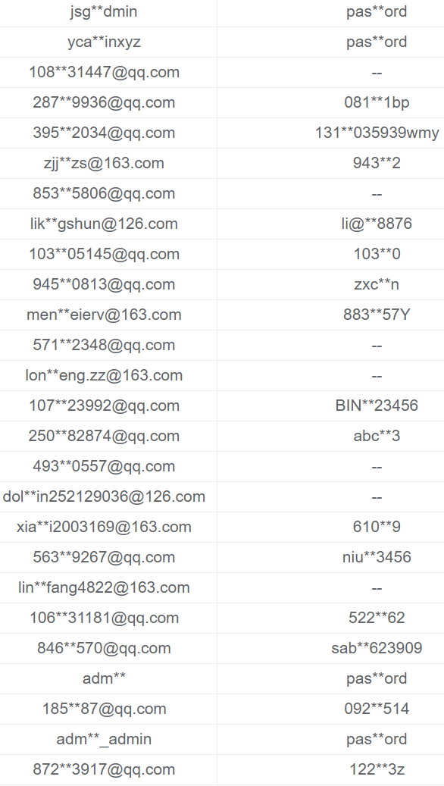
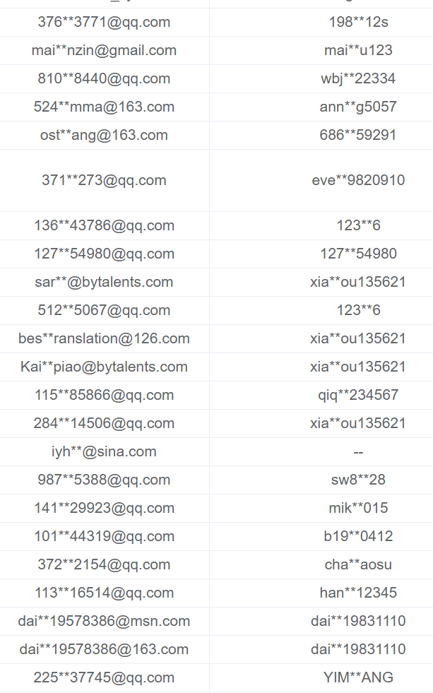

译马网存在重大安全漏洞，用户信息密码和业务数据已全部泄露

话不多说，直接上图：

 下载的记忆库文件

 

 获取的所有用户信息，包括密码

 

 账号和密码信息

图1
 

图2
 

图3
 

图4
 
 
本人是一名翻译爱好者，也懂一点python编程，最近尝试使用一款国内的在线辅助翻译软件译马网的时候，发现这个平台在裸奔啊！

1、任何人可以遍历他们平台所有的账号，我遍历的时候他们平台有9万多账号，里面还有机器批量生成的2万个虚假账号。奇葩的是，他们居然把密码的md5值也传输回来了，真是亮瞎了我的眼睛。于是我决定遍历一次，果然，所有账号的信息都搞到手了，哈哈。

2、报着好奇的心理，我想看看他们系统是不是记忆库也可以随便被遍历，果然有问题，甚至超出我的预期，因为居然可以拉取任何其他用户账号的所有数据信息，喔，不好意思，我又写了一个脚本遍历了一遍，拿到了所有用户的项目文件，记忆库和术语库，最后成功还下载了一大批记忆库文件。

译马网的介绍是：优译信息UEdrive是全球领先的语言服务与语言技术综合解决方案提供商，基于17年的语言数据积累，融合人工智能、内容管理、云计算等新兴技术，创造性地提供通达细腻的语言科技服务、打造贯穿供需的语言服务平台，致力于成为全球语言产业链运营商。

公司先后获得赛创、德商、界石、新译、技转、百度等机构的多轮投资，获得授权和受理发明专利32项，已通过国家高新技术企业认证，承担省市级科技项目2项。先后入选腾讯AI加速器、百度AI加速器、普华永道中国成都新经济创业企业加速营。

投资机构里还有百度哟，不知道百度是怎么尽调的，居然投资了一家技术这么菜鸡的企业。。。。。

官网上还说自己通过了ISO27001认证。。。，不知道是怎么搞到手的

最后说一句，一家对外宣称拿到这么多融资的在线辅助翻译平台的技术做到这个水平也是醉了。。。。我是不敢再用他们平台了
